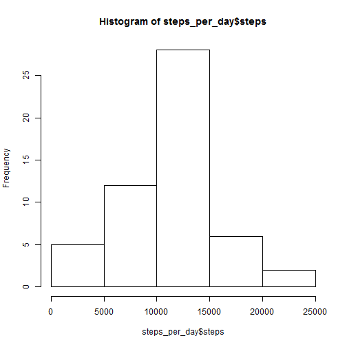
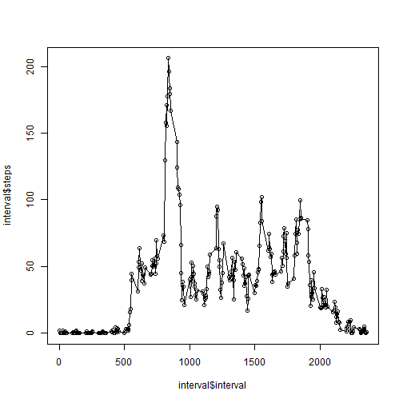

#RepData_PeerAssessment1
---
title: "PA1_template"
author: "David Liu"
date: "November 15, 2015"
output: 
  html_document:
    keep_md:yes
---

Loading and preprocessing the data

```r
setwd("C:/Users/David/Documents/Coursera_Data_Science/5_Reproducable_Research/project1/RepData_PeerAssessment1")
data<-read.csv("activity.csv")
data$interval<-as.numeric(data$interval)
data$date<-as.Date(data$date)
```
What is mean total number of steps taken per day?
1.Calculate the total number of steps taken per day

```r
#Calculate the total number of steps taken per day
good<-!is.na(data$steps)
data2<-data[good,]
library(plyr)
steps_per_day<-ddply(data2,.(date),summarize,steps=sum(steps))
```
2.Make a histogram of the total number of steps taken each day

```r
hist(steps_per_day$steps)
```

 

3.Calculate and report the mean and median of the total number of steps taken per day

```r
mean(steps_per_day$steps)
```

```
## [1] 10766.19
```

```r
median(steps_per_day$steps)
```

```
## [1] 10765
```

What is the average daily activity pattern?
1.Make a time series plot

```r
interval<-ddply(data2,.(interval),summarize,steps=mean(steps))
plot(interval$interval,interval$steps)
lines(interval$interval,interval$steps)
```

 

2.Which 5-minute interval, on average across all the days in the dataset, contains the maximum number of steps?

```r
interval$interval[which.max(interval$steps)]
```

```
## [1] 835
```

